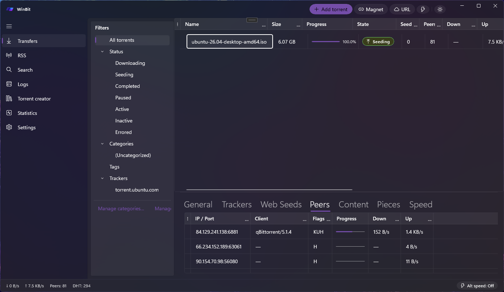

<h1>
   WinBit
</h1>

A modern, beautiful, Windows-native BitTorrent client. WinBit is a ground-up rebuild aimed at feature parity with [qBittorrent](https://www.qbittorrent.org/), built in C# / WinUI 3 with a Fluent Design front end.



## Why

qBittorrent is functionally excellent but visually dated — it wears its Qt heritage and optimizes for cross-platform pragmatism over native feel. WinBit keeps the feature set and rebuilds the experience around Windows 11: Mica backdrops, extended title bars, Segoe Fluent iconography, tasteful motion, dark/light theming, and controls that feel at home next to Settings and File Explorer.

## Status

In active development. See [`TASKS.md`](./TASKS.md) for the roadmap and [`docs/`](./docs/) for design details.

## Design mission

> **Modern and beautiful.**

This is a first-class design constraint, not a finish-line polish item. It drives control choice, layout, motion, and scope decisions throughout. The concrete rules live in [`docs/ui-design-language.md`](./docs/ui-design-language.md).

## Architecture at a glance

Three-project solution plus an in-repo binding library:

| Project | Purpose |
|---|---|
| `WinBit.Core` | Pure C# class library. BitTorrent engine wrapper (libtorrent via LibtorrentSharp), settings, persistence (SQLite + JSON), RSS, WebUI (Kestrel), logging. No Windows UI dependencies. |
| `WinBit` | WinUI 3 desktop app. Views, viewmodels, DI composition root, Fluent controls. |
| `WinBit.Tests` | xUnit tests against `WinBit.Core`. |
| `libtorrentsharp/LibtorrentSharp` | Full-fidelity C# binding to libtorrent-rasterbar, incubated in-repo as a future standalone NuGet. |

Full map in [`docs/architecture.md`](./docs/architecture.md).

## Feature goals

Full qBittorrent parity: transfer list, categories/tags, share limits, bandwidth scheduler, RSS + auto-downloader, IP filter, UPnP/NAT-PMP, DHT/PEX/LSD, proxy, Web UI (qBittorrent v2 API compatible), search engine plugins, watched folders, torrent creator, execution log, tray + toasts + sleep prevention, `.torrent` / `magnet:` file associations.

## Build & run

**Prerequisites**

- Windows 11 (or Windows 10 build 17763+).
- Visual Studio 2022 17.10+ with the *Windows App SDK C# Templates* workload **or** .NET 8 SDK + Windows SDK build tools.

**Build**

```pwsh
dotnet build WinBit.slnx -c Debug -r win-x64
```

**Test**

```pwsh
dotnet test WinBit.slnx
```

**Run**

From Visual Studio, set `WinBit` as the startup project and press F5. From the CLI:

```pwsh
dotnet run --project WinBit -c Debug
```

More detail (packaging, MSIX) in [`docs/development.md`](./docs/development.md).

## Documentation

- [`TASKS.md`](./TASKS.md) — feature roadmap.
- [`docs/architecture.md`](./docs/architecture.md) — solution layout + service interfaces.
- [`docs/ui-design-language.md`](./docs/ui-design-language.md) — colors, typography, motion, control rules.
- [`docs/torrent-engine.md`](./docs/torrent-engine.md) — libtorrent integration + engine choice rationale.
- [`docs/libtorrent-binding.md`](./docs/libtorrent-binding.md) — LibtorrentSharp architecture.
- [`docs/persistence.md`](./docs/persistence.md) — SQLite schema, JSON shapes, file-system layout.
- [`docs/webui-api.md`](./docs/webui-api.md) — REST surface (qBittorrent v2 parity).
- [`docs/rss-autodownloader.md`](./docs/rss-autodownloader.md) — rule semantics.
- [`docs/development.md`](./docs/development.md) — build, run, test, package, troubleshoot.

## License

WinBit is licensed under the **GNU General Public License v2.0 or later** (GPL-2.0-or-later) — the same license as [qBittorrent](https://www.qbittorrent.org/), whose behavior WinBit ports. See [`LICENSE`](./LICENSE) for the full text.
